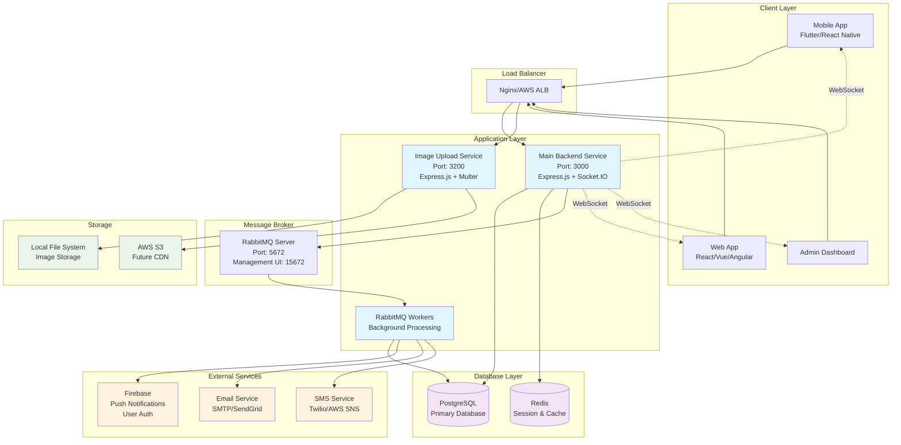
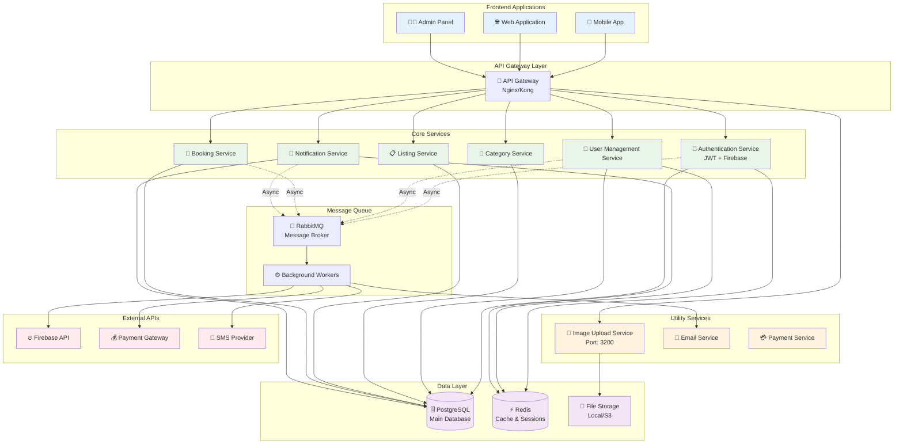
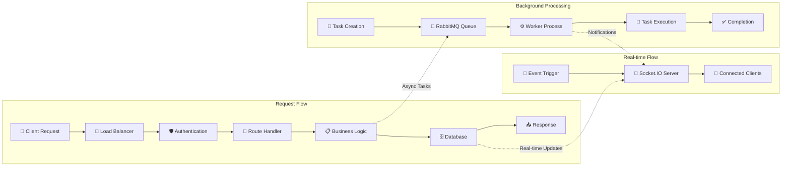
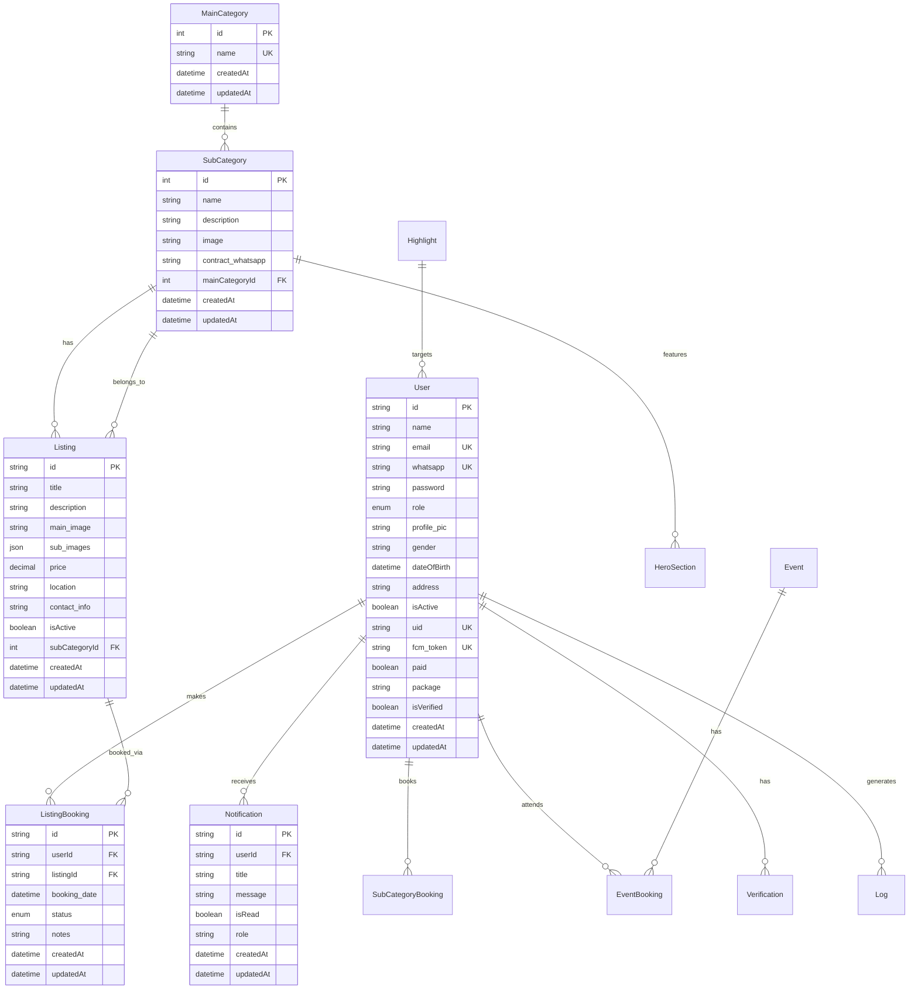
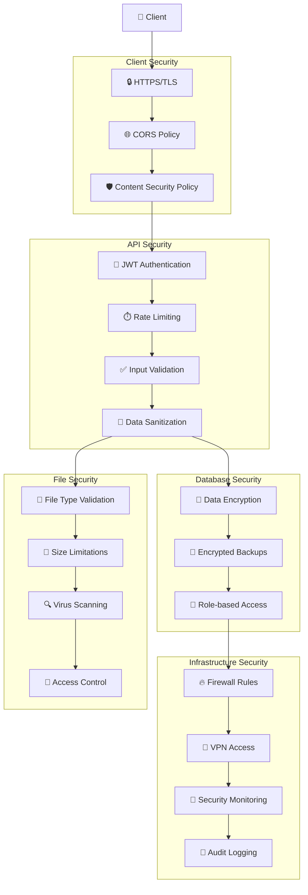
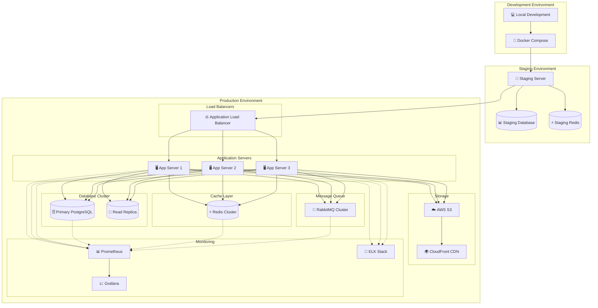

# 🏗️ System Architecture Diagrams

## High-Level System Overview

## Microservices Architecture

## Data Flow Architecture

## Database Schema Architecture

## Security Architecture

## Deployment Architecture

## CI/CD Pipeline

```mermaid
graph LR
    subgraph "Development"
        Code[💻 Code Changes]
        Git[📝 Git Commit]
        PR[🔀 Pull Request]
    end
    
    subgraph "CI Pipeline"
        Build[🔨 Build]
        Test[🧪 Run Tests]
        Lint[🔍 Code Quality]
        Security[🔐 Security Scan]
        Docker[🐳 Docker Build]
    end
    
    subgraph "CD Pipeline"
        Deploy[🚀 Deploy to Staging]
        E2E[🎭 E2E Tests]
        Manual[👤 Manual Approval]
        Prod[🌟 Deploy to Production]
    end
    
    subgraph "Monitoring"
        Health[❤️ Health Checks]
        Metrics[📊 Metrics Collection]
        Alerts[🚨 Alerting]
        Rollback[⏪ Auto Rollback]
    end
    
    Code --> Git
    Git --> PR
    PR --> Build
    Build --> Test
    Test --> Lint
    Lint --> Security
    Security --> Docker
    Docker --> Deploy
    Deploy --> E2E
    E2E --> Manual
    Manual --> Prod
    Prod --> Health
    Health --> Metrics
    Metrics --> Alerts
    Alerts --> Rollback
    
    classDef dev fill:#e3f2fd
    classDef ci fill:#e8f5e8
    classDef cd fill:#fff3e0
    classDef monitor fill:#f3e5f5
    
    class Code,Git,PR dev
    class Build,Test,Lint,Security,Docker ci
    class Deploy,E2E,Manual,Prod cd
    class Health,Metrics,Alerts,Rollback monitor
```

