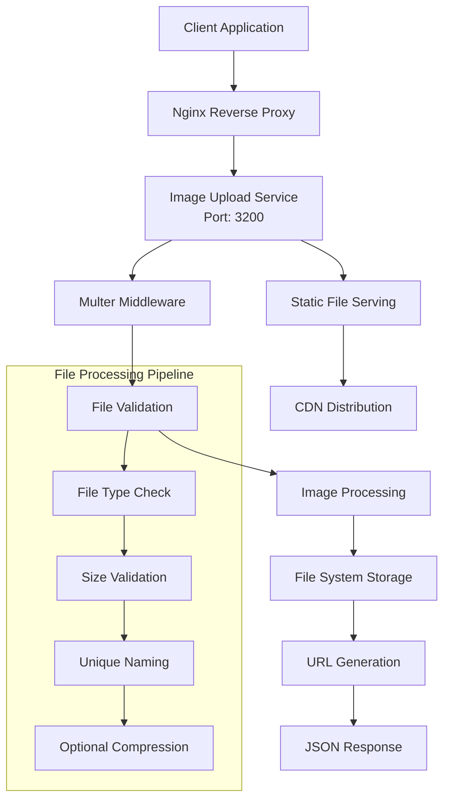
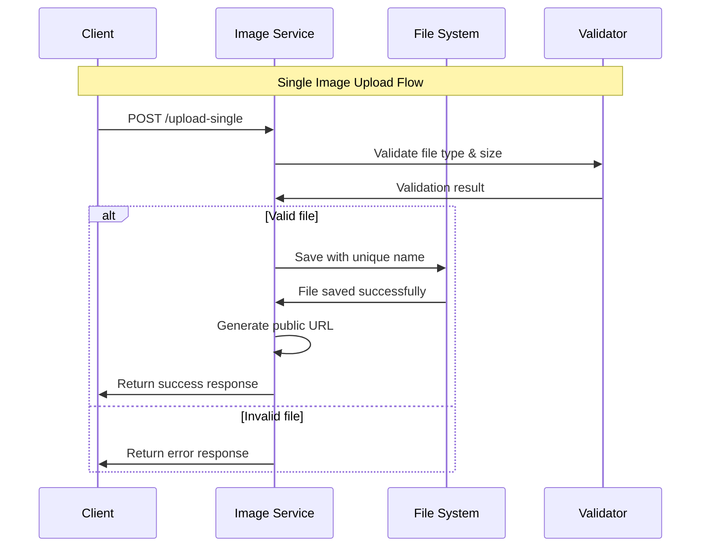
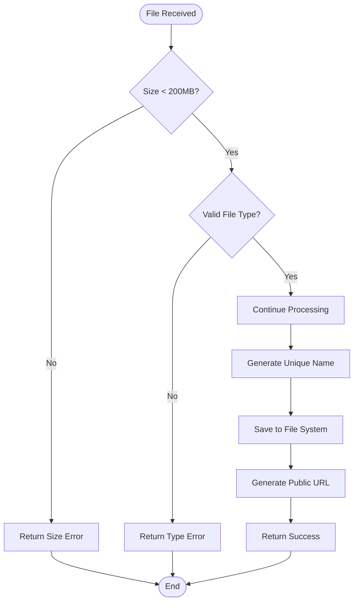
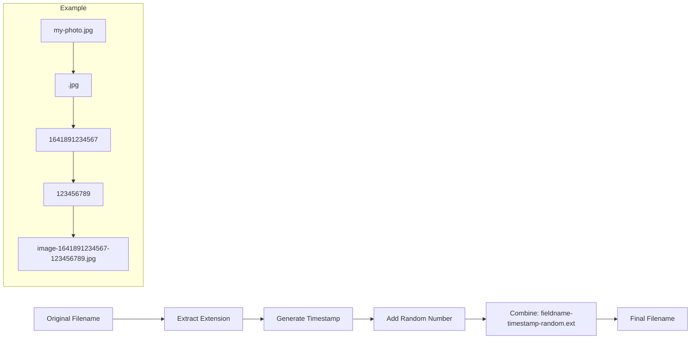
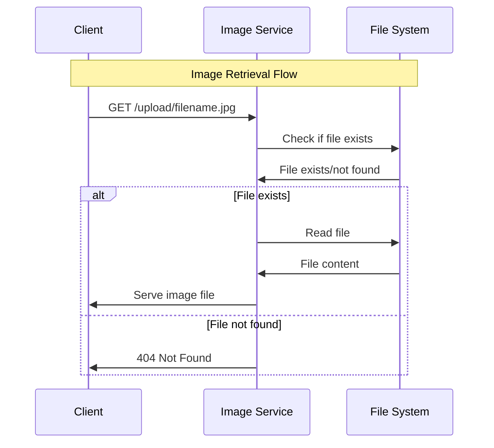
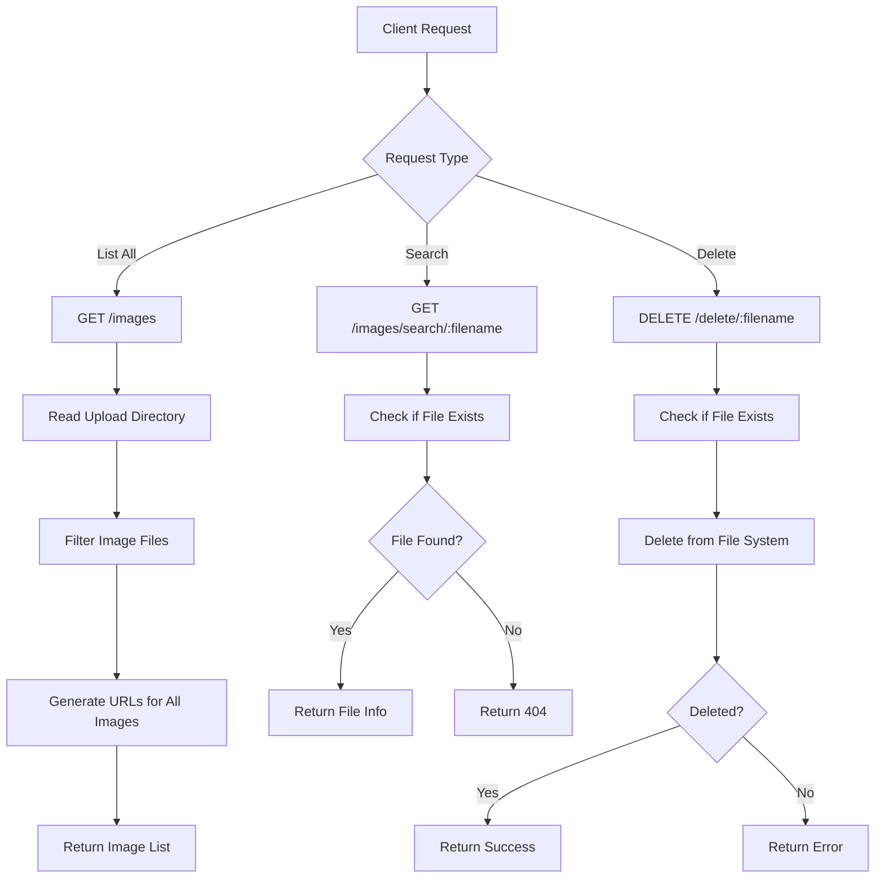
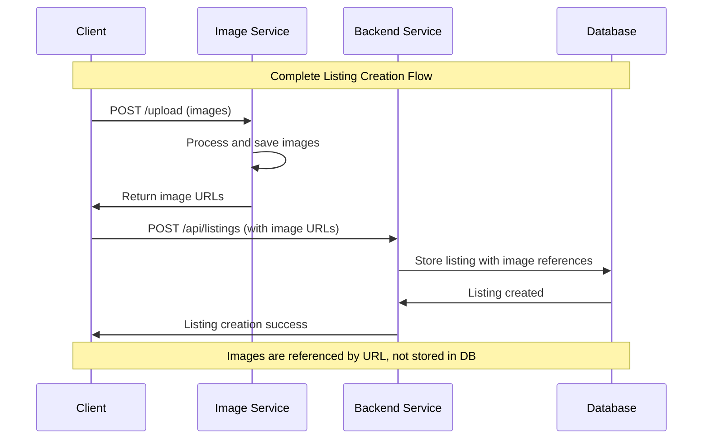

# 📸 Image Upload Service - Detailed Flow

## Overview

The Image Upload Service is a dedicated microservice responsible for handling all image upload, processing, and serving operations in the Abyansf application. It runs on port 3200 and provides a robust, scalable solution for image management.

## Architecture



## File Upload Flow

### 1. Single File Upload



**Request Example:**
```javascript
const formData = new FormData();
formData.append('image', file);

const response = await fetch('http://localhost:3200/upload-single', {
    method: 'POST',
    body: formData
});

const result = await response.json();
```

**Response Format:**
```json
{
    "message": "File uploaded successfully!",
    "file": {
        "url": "http://localhost:3200/upload/image-1641891234567-123456789.jpg",
        "filename": "image-1641891234567-123456789.jpg",
        "originalname": "my-photo.jpg",
        "size": 2048576
    },
    "success": true
}
```

### 2. Multiple File Upload


**Request Example:**
```javascript
const formData = new FormData();
formData.append('main_image', mainImageFile);
formData.append('sub_images', subImage1);
formData.append('sub_images', subImage2);
formData.append('sub_images', subImage3);

const response = await fetch('http://localhost:3200/upload', {
    method: 'POST',
    body: formData
});
```

**Response Format:**
```json
{
    "message": "Files uploaded successfully!",
    "main_image": {
        "url": "http://localhost:3200/upload/main_image-1641891234567-123456789.jpg",
        "filename": "main_image-1641891234567-123456789.jpg",
        "originalname": "main-photo.jpg",
        "size": 3145728
    },
    "sub_images": [
        {
            "url": "http://localhost:3200/upload/sub_images-1641891234568-987654321.jpg",
            "filename": "sub_images-1641891234568-987654321.jpg",
            "originalname": "sub-photo-1.jpg",
            "size": 1048576
        },
        {
            "url": "http://localhost:3200/upload/sub_images-1641891234569-456789123.jpg",
            "filename": "sub_images-1641891234569-456789123.jpg",
            "originalname": "sub-photo-2.jpg",
            "size": 2097152
        }
    ],
    "success": true
}
```

## File Processing Pipeline

### 1. File Validation



**Validation Rules:**
```javascript
// File size limit
const MAX_FILE_SIZE = 200 * 1024 * 1024; // 200MB

// Allowed file types
const ALLOWED_TYPES = [
    'image/jpeg',
    'image/jpg', 
    'image/png',
    'image/gif',
    'image/webp'
];

// File extension validation
const ALLOWED_EXTENSIONS = ['.jpg', '.jpeg', '.png', '.gif', '.webp'];
```

### 2. Unique Filename Generation



**Implementation:**
```javascript
const storage = multer.diskStorage({
    destination: (req, file, cb) => {
        cb(null, UPLOAD_DIR);
    },
    filename: (req, file, cb) => {
        const uniqueSuffix = Date.now() + '-' + Math.round(Math.random() * 1E9);
        const extension = path.extname(file.originalname);
        cb(null, file.fieldname + '-' + uniqueSuffix + extension);
    }
});
```

### 3. URL Generation

```javascript
const baseUrl = process.env.BASE_URL || 'http://localhost:3200';

const getFileUrl = (filename) => {
    return `${baseUrl}/upload/${filename}`;
};
```

## Image Serving and Management

### 1. Static File Serving



### 2. Image Search and Listing



## API Endpoints

### Upload Endpoints

| Endpoint | Method | Description | Request Body |
|----------|--------|-------------|--------------|
| `/upload-single` | POST | Single file upload | FormData with 'image' field |
| `/upload` | POST | Multiple files upload | FormData with 'main_image' and 'sub_images' |

### Retrieval Endpoints

| Endpoint | Method | Description | Response |
|----------|--------|-------------|----------|
| `/upload/:filename` | GET | Serve specific image | Image file |
| `/images` | GET | List all images | Array of image URLs |
| `/images/search/:filename` | GET | Search for specific image | Image info or 404 |

### Management Endpoints

| Endpoint | Method | Description | Response |
|----------|--------|-------------|----------|
| `/delete/:filename` | DELETE | Delete specific image | Success/Error message |

## Integration with Main Backend

### 1. Listing Creation Flow



### 2. URL Structure

```javascript
// Image URLs returned by Image Service
const imageUrl = "http://localhost:3200/upload/main_image-1641891234567-123456789.jpg";

// Used in listing data
const listingData = {
    title: "Amazing Service",
    description: "Service description",
    main_image: imageUrl,
    sub_images: [
        "http://localhost:3200/upload/sub_images-1641891234568-987654321.jpg",
        "http://localhost:3200/upload/sub_images-1641891234569-456789123.jpg"
    ],
    // ... other listing fields
};
```

## Error Handling

### 1. File Validation Errors

```javascript
// File size error
{
    "error": "File too large. Maximum size is 200MB.",
    "success": false
}

// File type error
{
    "error": "Invalid file type. Only JPG, PNG, GIF, and WEBP are allowed.",
    "success": false
}

// No file provided
{
    "error": "No file was uploaded.",
    "success": false
}
```

### 2. Server Errors

```javascript
// File system error
{
    "error": "Failed to save file to disk.",
    "success": false
}

// Directory access error
{
    "error": "Upload directory is not accessible.",
    "success": false
}
```

## Configuration

### Environment Variables

```env
# Server configuration
PORT=3200
BASE_URL=http://localhost:3200

# File upload configuration
MAX_FILE_SIZE=209715200  # 200MB in bytes
UPLOAD_DIR=./uploads

# CORS configuration
CORS_ORIGIN=*
```

### Multer Configuration

```javascript
const upload = multer({
    storage: storage,
    limits: { 
        fileSize: 200 * 1024 * 1024  // 200MB
    },
    fileFilter: (req, file, cb) => {
        const allowedTypes = ['image/jpeg', 'image/jpg', 'image/png', 'image/gif', 'image/webp'];
        if (allowedTypes.includes(file.mimetype)) {
            cb(null, true);
        } else {
            cb(new Error('Invalid file type'), false);
        }
    }
});
```

## Performance Optimization

### 1. File Compression (Future Enhancement)

```javascript
import sharp from 'sharp';

const compressImage = async (inputPath, outputPath) => {
    await sharp(inputPath)
        .resize(1920, 1080, { 
            fit: sharp.fit.inside,
            withoutEnlargement: true 
        })
        .jpeg({ 
            quality: 85,
            progressive: true 
        })
        .toFile(outputPath);
};
```

### 2. CDN Integration

```javascript
// Future: Upload to AWS S3 or similar
const uploadToS3 = async (file) => {
    const params = {
        Bucket: 'your-bucket-name',
        Key: file.filename,
        Body: fs.createReadStream(file.path),
        ContentType: file.mimetype
    };
    
    return await s3.upload(params).promise();
};
```

### 3. Caching Headers

```javascript
app.use('/upload', (req, res, next) => {
    res.set({
        'Cache-Control': 'public, max-age=31536000', // 1 year
        'ETag': req.params.filename
    });
    next();
});
```

## Security Considerations

### 1. File Type Validation

- Check both MIME type and file extension
- Prevent executable file uploads
- Scan for malicious content

### 2. File Size Limits

- Prevent DoS attacks via large files
- Set appropriate limits based on use case

### 3. Access Control

- Implement authentication for upload endpoints
- Add rate limiting for upload requests
- Validate user permissions

## Monitoring and Logging

### 1. Upload Metrics

```javascript
// Track upload statistics
const uploadMetrics = {
    totalUploads: 0,
    successfulUploads: 0,
    failedUploads: 0,
    totalSizeUploaded: 0
};

// Log upload events
console.log(`[📁 UPLOAD] File: ${filename}, Size: ${size}bytes, User: ${userId}`);
```

### 2. Health Checks

```javascript
app.get('/health', (req, res) => {
    const stats = fs.statSync(UPLOAD_DIR);
    
    res.json({
        status: 'healthy',
        uptime: process.uptime(),
        uploadDir: {
            exists: stats.isDirectory(),
            writable: true // Check write permissions
        },
        diskSpace: {
            // Add disk space check
        }
    });
});
```
