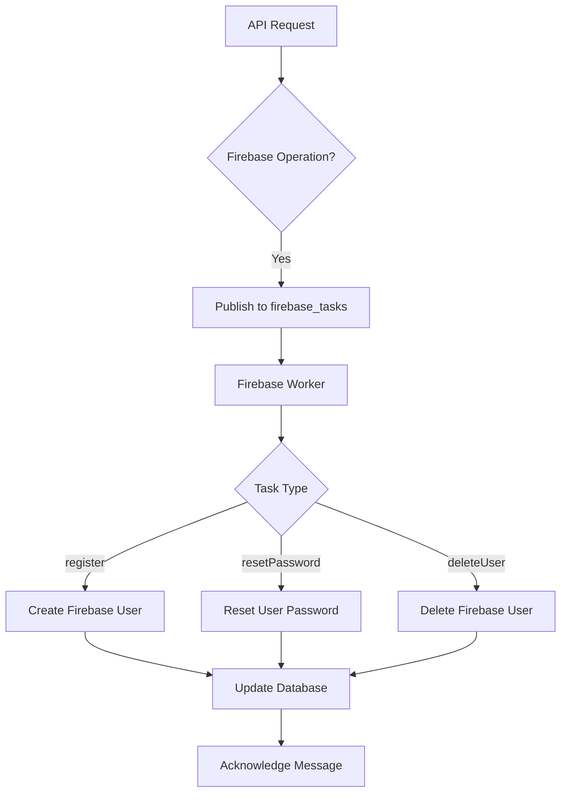
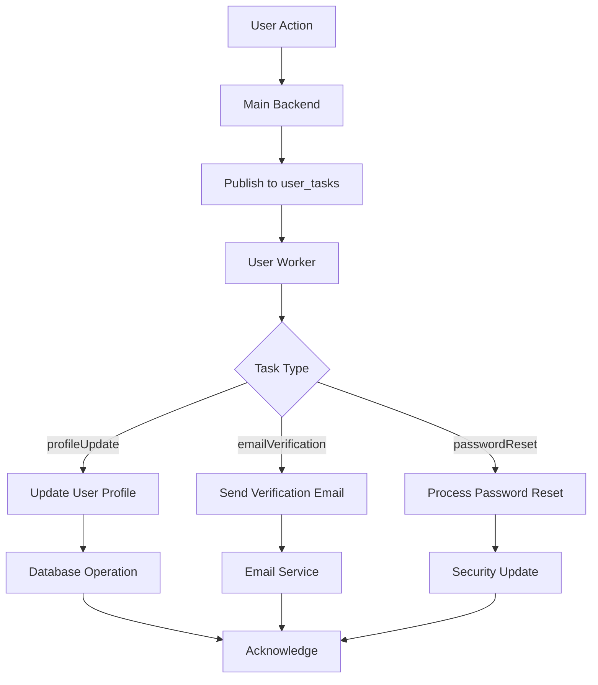
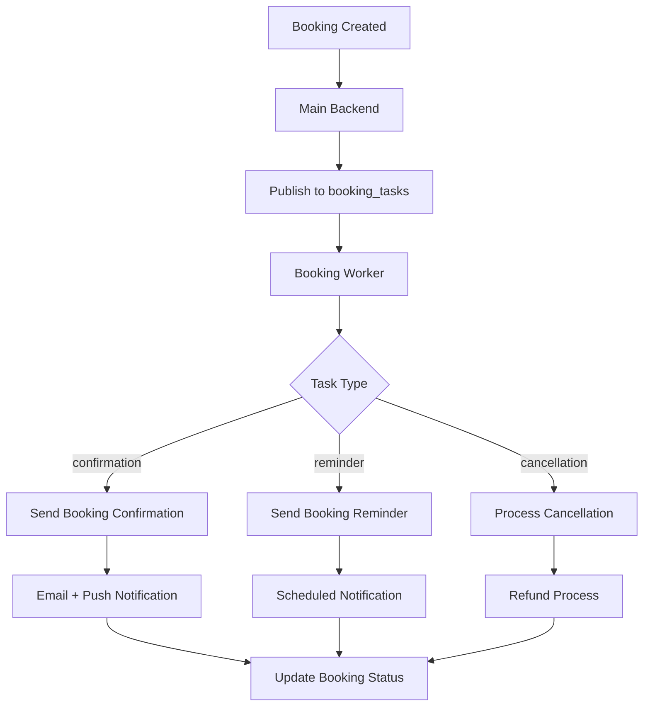
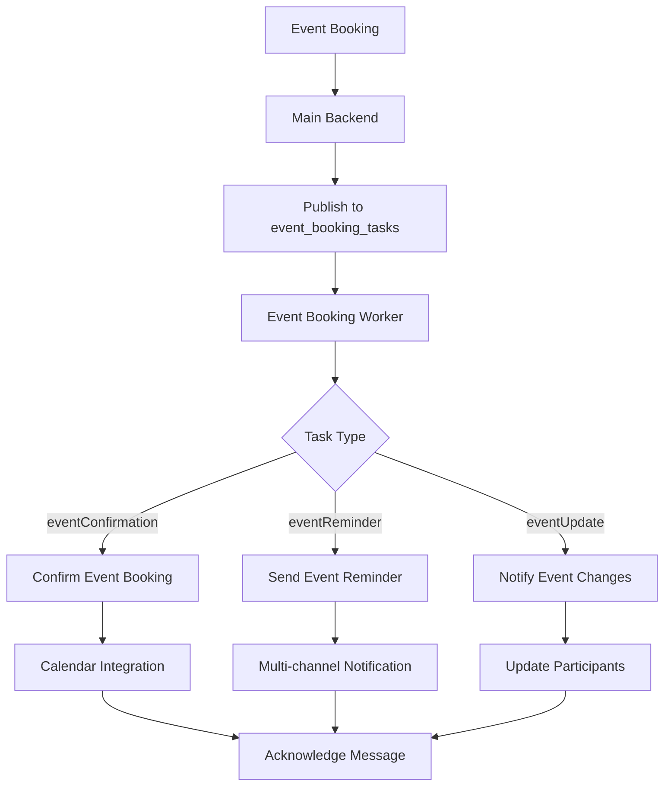
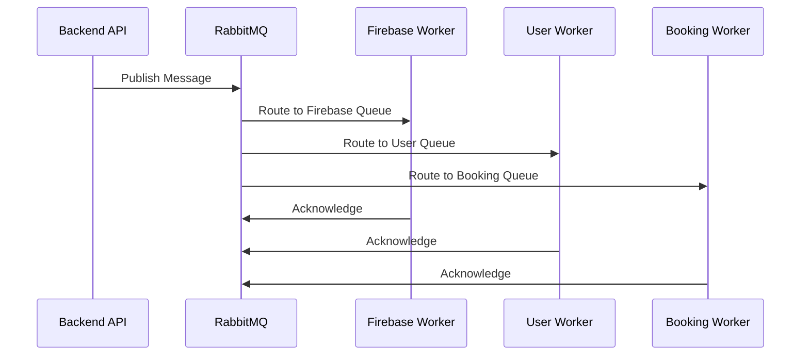
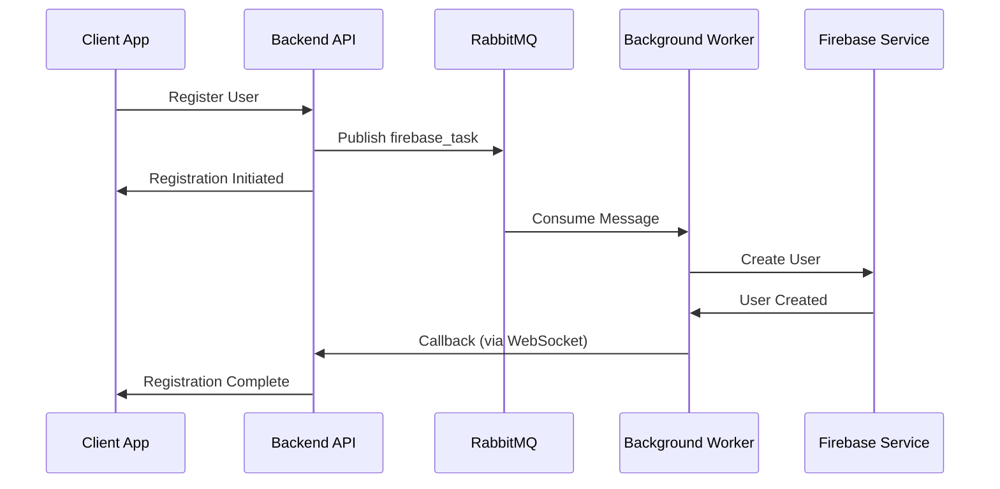
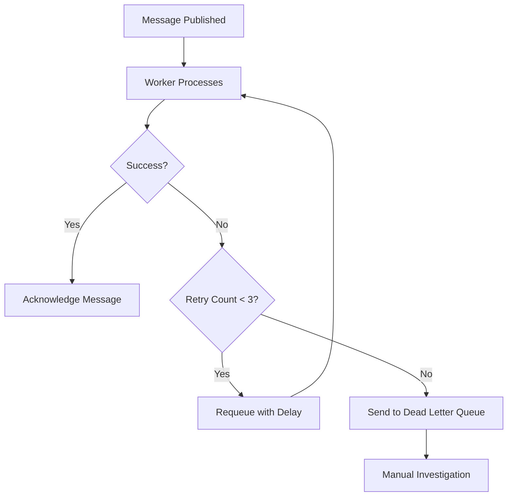

# 🔄 RabbitMQ Message Broker Flow - Detailed Explanation

## Overview

RabbitMQ serves as the central message broker in the Abyansf application, enabling asynchronous processing of various tasks including user management, notifications, bookings, and Firebase operations.

## Queue Architecture

### 1. Firebase Tasks Queue (`firebase_tasks`)

**Purpose**: Handles all Firebase-related operations
**Worker**: `firebaseWorker.js`



**Message Structure**:
```json
{
  "type": "register",
  "email": "user@example.com",
  "password": "hashedPassword",
  "displayName": "John Doe",
  "timestamp": "2025-01-11T10:30:00Z"
}
```

### 2. User Tasks Queue (`user_tasks`)

**Purpose**: Processes user-related background tasks
**Worker**: `userWorker.js`



### 3. Listing Booking Queue (`booking_tasks`)

**Purpose**: Handles booking confirmations and related operations
**Worker**: `listingBookingWorker.js`



### 4. Event Booking Queue (`event_booking_tasks`)

**Purpose**: Manages event-specific booking operations
**Worker**: `eventBookingWorker.js`



## Message Flow Patterns

### 1. Publisher-Subscriber Pattern



### 2. Request-Response Pattern



### 3. Dead Letter Queue Pattern



## Worker Implementation Details

### Firebase Worker (`firebaseWorker.js`)

```javascript
async function startFirebaseWorker(connection) {
  const channel = await connection.createChannel();
  await channel.assertQueue(QUEUE_NAME, { durable: true });

  channel.consume(QUEUE_NAME, async (msg) => {
    if (msg !== null) {
      const task = JSON.parse(msg.content.toString());
      
      try {
        let result;
        switch (task.type) {
          case 'register':
            result = await authService.register(
              task.email, 
              task.password, 
              task.displayName
            );
            break;
          case 'resetPassword':
            result = await authService.resetPassword(
              task.uid, 
              task.newPassword
            );
            break;
          case 'deleteUser':
            result = await authService.deleteUser(task.uid);
            break;
          default:
            throw new Error('Unknown task type');
        }
        
        console.log('Firebase Task Result:', result);
        channel.ack(msg);
      } catch (error) {
        console.error('Firebase Task Error:', error);
        // Implement retry logic or send to DLQ
        channel.nack(msg, false, false);
      }
    }
  });
}
```

### User Worker (`userWorker.js`)

```javascript
async function startUserWorker(connection) {
  const channel = await connection.createChannel();
  await channel.assertQueue('user_tasks', { durable: true });

  channel.consume('user_tasks', async (msg) => {
    if (msg !== null) {
      const task = JSON.parse(msg.content.toString());
      
      try {
        switch (task.type) {
          case 'profileUpdate':
            await updateUserProfile(task.userId, task.data);
            break;
          case 'emailVerification':
            await sendVerificationEmail(task.email, task.code);
            break;
          case 'passwordReset':
            await processPasswordReset(task.userId);
            break;
        }
        
        channel.ack(msg);
      } catch (error) {
        console.error('User Task Error:', error);
        channel.nack(msg, false, false);
      }
    }
  });
}
```

## Message Publishing from Backend

### How Backend Publishes Messages

```javascript
import amqp from 'amqplib';

class MessagePublisher {
  constructor() {
    this.connection = null;
    this.channel = null;
  }

  async connect() {
    this.connection = await amqp.connect(RABBITMQ_URL);
    this.channel = await this.connection.createChannel();
  }

  async publishFirebaseTask(task) {
    const message = {
      type: task.type,
      ...task.data,
      timestamp: new Date().toISOString()
    };

    await this.channel.assertQueue('firebase_tasks', { durable: true });
    this.channel.sendToQueue(
      'firebase_tasks',
      Buffer.from(JSON.stringify(message)),
      { persistent: true }
    );
  }

  async publishUserTask(task) {
    const message = {
      type: task.type,
      ...task.data,
      timestamp: new Date().toISOString()
    };

    await this.channel.assertQueue('user_tasks', { durable: true });
    this.channel.sendToQueue(
      'user_tasks',
      Buffer.from(JSON.stringify(message)),
      { persistent: true }
    );
  }
}
```

### Usage in Controllers

```javascript
// In userController.js
export const registerUser = async (req, res) => {
  try {
    // Store user in database first
    const user = await prisma.user.create({
      data: req.body
    });

    // Publish Firebase task
    await messagePublisher.publishFirebaseTask({
      type: 'register',
      data: {
        email: user.email,
        password: req.body.password,
        displayName: user.name
      }
    });

    res.status(201).json({
      success: true,
      message: 'User registration initiated',
      userId: user.id
    });
  } catch (error) {
    res.status(500).json({ error: error.message });
  }
};
```

## Error Handling and Reliability

### 1. Message Durability

```javascript
// Queues are declared as durable
await channel.assertQueue(QUEUE_NAME, { durable: true });

// Messages are marked as persistent
channel.sendToQueue(queue, message, { persistent: true });
```

### 2. Acknowledgment Strategy

```javascript
// Positive acknowledgment (message processed successfully)
channel.ack(msg);

// Negative acknowledgment with requeue
channel.nack(msg, false, true);

// Negative acknowledgment without requeue (send to DLQ)
channel.nack(msg, false, false);
```

### 3. Connection Recovery

```javascript
async function runAllWorkers() {
  try {
    const connection = await amqp.connect(RABBITMQ_URL);
    
    connection.on('error', (err) => {
      console.error('Connection error:', err.message);
    });

    connection.on('close', () => {
      console.warn('Connection closed. Retrying in 5 seconds...');
      setTimeout(runAllWorkers, 5000);
    });

    // Start all workers
    await startFirebaseWorker(connection);
    await startUserWorker(connection);
    await startListingBookingWorker(connection);
    
  } catch (error) {
    console.error('Failed to connect to RabbitMQ:', error);
    setTimeout(runAllWorkers, 5000);
  }
}
```

## Monitoring and Management

### 1. RabbitMQ Management UI

Access: `http://localhost:15672`
- Monitor queue lengths
- View message rates
- Check consumer status
- Manage exchanges and bindings

### 2. Worker Health Checks

```javascript
// Add health check endpoints
app.get('/health/rabbitmq', async (req, res) => {
  try {
    // Check connection status
    const isConnected = connection && !connection.connection.stream.destroyed;
    
    res.json({
      status: isConnected ? 'healthy' : 'unhealthy',
      queues: {
        firebase_tasks: await getQueueInfo('firebase_tasks'),
        user_tasks: await getQueueInfo('user_tasks'),
        booking_tasks: await getQueueInfo('booking_tasks')
      }
    });
  } catch (error) {
    res.status(500).json({ status: 'error', error: error.message });
  }
});
```

### 3. Logging and Metrics

```javascript
// Worker logging
console.log(`[✅] Worker started for queue: ${QUEUE_NAME}`);
console.log(`[📩 Task Received]: ${task.type}`);
console.log(`[✅ Task Completed]: ${result}`);
console.log(`[❌ Task Failed]: ${error.message}`);
```

## Best Practices

1. **Message Idempotency**: Ensure operations can be safely retried
2. **Proper Error Handling**: Use try-catch blocks and proper acknowledgments
3. **Connection Management**: Implement connection recovery and health checks
4. **Queue Monitoring**: Monitor queue lengths and processing rates
5. **Message TTL**: Set time-to-live for messages to prevent queue buildup
6. **Dead Letter Queues**: Handle failed messages appropriately
7. **Resource Cleanup**: Properly close channels and connections
