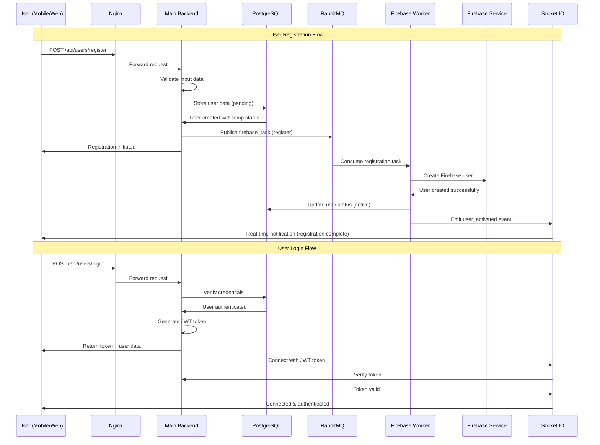
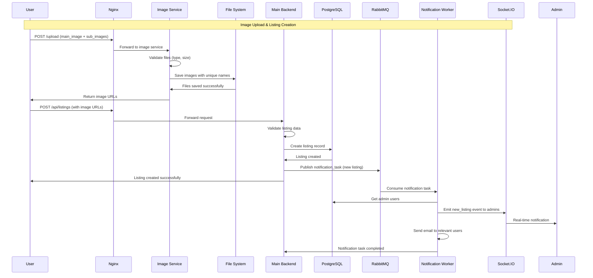
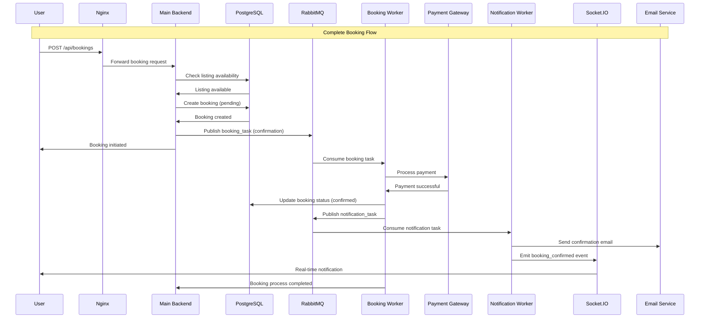
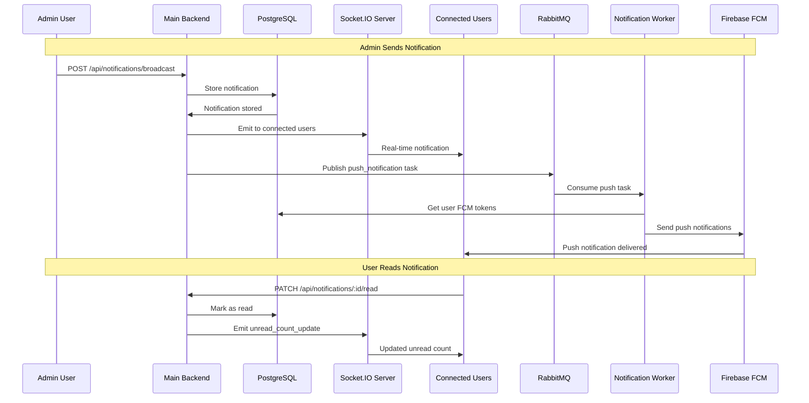
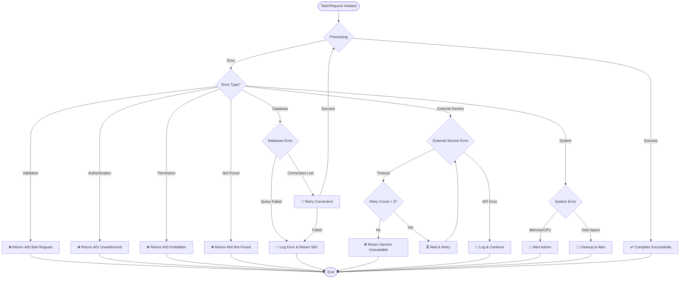
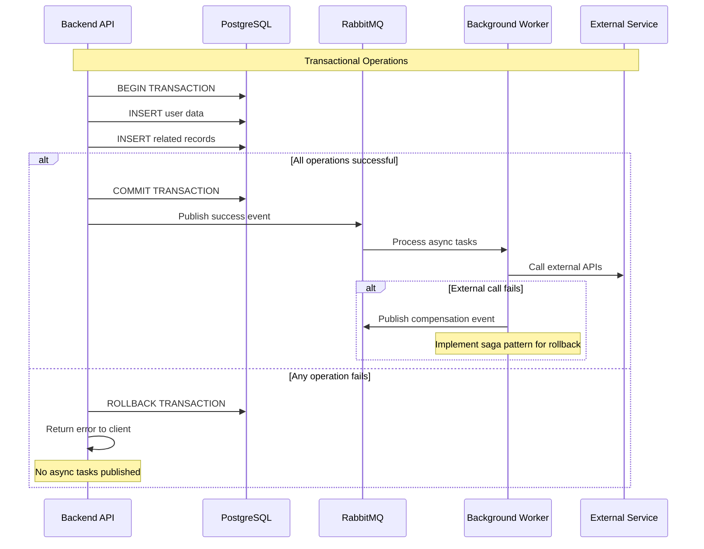
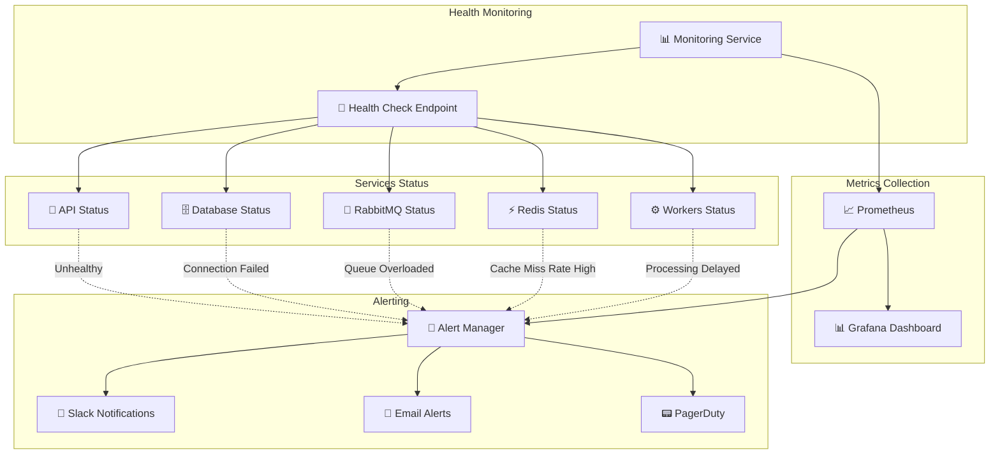
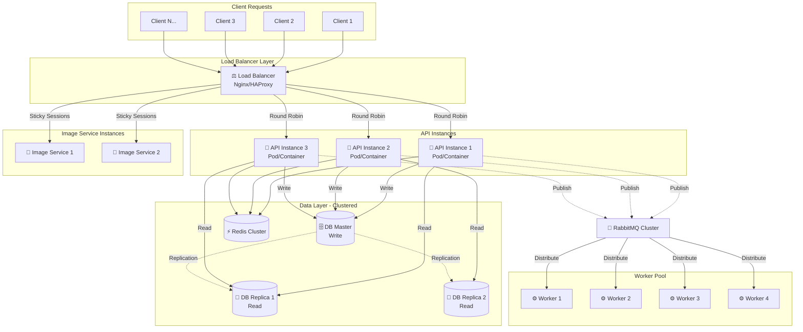

# 🔄 Complete System Flow Diagram

## Full Application Flow

```mermaid
graph TB
    subgraph "Client Applications"
        Mobile[📱 Mobile App<br/>Flutter/React Native]
        Web[🌐 Web Application<br/>React/Vue/Angular]
        Admin[👨‍💼 Admin Dashboard]
    end
    
    subgraph "API Gateway & Load Balancer"
        Nginx[⚖️ Nginx<br/>Reverse Proxy<br/>SSL Termination]
    end
    
    subgraph "Backend Services"
        MainAPI[🎯 Main Backend API<br/>Port: 3000<br/>Express.js + Socket.IO]
        ImageAPI[📸 Image Upload Service<br/>Port: 3200<br/>Express.js + Multer]
    end
    
    subgraph "Message Broker System"
        RabbitMQ[🐰 RabbitMQ Server<br/>Port: 5672<br/>Message Broker]
        
        subgraph "Worker Processes"
            FirebaseWorker[🔥 Firebase Worker<br/>User Management]
            UserWorker[👤 User Worker<br/>Profile Updates]
            BookingWorker[📅 Booking Worker<br/>Confirmations]
            EventWorker[🎉 Event Worker<br/>Event Management]
            NotificationWorker[🔔 Notification Worker<br/>Push Notifications]
        end
    end
    
    subgraph "Data Storage"
        PostgreSQL[(🗄️ PostgreSQL<br/>Primary Database<br/>Users, Bookings, etc.)]
        Redis[(⚡ Redis<br/>Cache & Sessions)]
        FileSystem[📁 File System<br/>Image Storage<br/>./uploads/)]
    end
    
    subgraph "External Services"
        Firebase[🔥 Firebase<br/>Push Notifications<br/>User Authentication]
        EmailSvc[📧 Email Service<br/>SMTP/SendGrid]
        SMS[📱 SMS Service<br/>Twilio/AWS SNS]
        PaymentGW[💳 Payment Gateway<br/>Stripe/PayPal]
    end
    
    subgraph "Monitoring & Logging"
        Prometheus[📊 Prometheus<br/>Metrics Collection]
        Grafana[📈 Grafana<br/>Dashboards]
        ELK[📝 ELK Stack<br/>Log Management]
    end
    
    %% Client connections
    Mobile -.->|HTTPS/WSS| Nginx
    Web -.->|HTTPS/WSS| Nginx
    Admin -.->|HTTPS/WSS| Nginx
    
    %% Load balancer routing
    Nginx -->|API Requests| MainAPI
    Nginx -->|Image Uploads| ImageAPI
    Nginx -->|WebSocket| MainAPI
    
    %% Service to database connections
    MainAPI -->|Read/Write| PostgreSQL
    MainAPI -->|Cache| Redis
    ImageAPI -->|Store Files| FileSystem
    
    %% Message broker connections
    MainAPI -->|Publish Tasks| RabbitMQ
    ImageAPI -->|Publish Tasks| RabbitMQ
    
    RabbitMQ -->|Consume| FirebaseWorker
    RabbitMQ -->|Consume| UserWorker
    RabbitMQ -->|Consume| BookingWorker
    RabbitMQ -->|Consume| EventWorker
    RabbitMQ -->|Consume| NotificationWorker
    
    %% Worker connections
    FirebaseWorker -->|Read/Write| PostgreSQL
    UserWorker -->|Read/Write| PostgreSQL
    BookingWorker -->|Read/Write| PostgreSQL
    EventWorker -->|Read/Write| PostgreSQL
    NotificationWorker -->|Read/Write| PostgreSQL
    
    %% External service connections
    FirebaseWorker -->|API Calls| Firebase
    NotificationWorker -->|Send Push| Firebase
    NotificationWorker -->|Send Email| EmailSvc
    NotificationWorker -->|Send SMS| SMS
    BookingWorker -->|Process Payment| PaymentGW
    
    %% Real-time connections (dashed lines for WebSocket)
    MainAPI -.->|Real-time Events| Mobile
    MainAPI -.->|Real-time Events| Web
    MainAPI -.->|Real-time Events| Admin
    
    %% Monitoring connections
    MainAPI -.->|Metrics| Prometheus
    ImageAPI -.->|Metrics| Prometheus
    PostgreSQL -.->|Metrics| Prometheus
    Redis -.->|Metrics| Prometheus
    RabbitMQ -.->|Metrics| Prometheus
    
    MainAPI -.->|Logs| ELK
    ImageAPI -.->|Logs| ELK
    FirebaseWorker -.->|Logs| ELK
    
    Prometheus -->|Visualize| Grafana
    
    classDef client fill:#e3f2fd,stroke:#1976d2
    classDef service fill:#e8f5e8,stroke:#388e3c
    classDef data fill:#f3e5f5,stroke:#7b1fa2
    classDef external fill:#fff3e0,stroke:#f57c00
    classDef monitor fill:#ffebee,stroke:#d32f2f
    classDef worker fill:#e0f2f1,stroke:#00695c
    
    class Mobile,Web,Admin client
    class MainAPI,ImageAPI,Nginx service
    class PostgreSQL,Redis,FileSystem data
    class Firebase,EmailSvc,SMS,PaymentGW external
    class Prometheus,Grafana,ELK monitor
    class FirebaseWorker,UserWorker,BookingWorker,EventWorker,NotificationWorker worker
```

## User Registration & Authentication Flow



## Image Upload & Listing Creation Flow



## Booking Process Flow



## Real-time Notification Flow



## Error Handling & Recovery Flow



## Data Consistency & Transaction Flow



## Monitoring & Health Check Flow



## Scaling & Load Distribution



This comprehensive documentation provides a complete overview of your Abyansf backend system, including:

1. **Enhanced README** with proper markdown formatting and diagrams
2. **Detailed RabbitMQ flow** explaining message broker operations
3. **Image upload service flow** with step-by-step processing
4. **System architecture** showing all components and their relationships
5. **API documentation** for quick reference
6. **Deployment guide** for production setup

The diagrams use Mermaid syntax which will render beautifully in GitHub and most markdown viewers, providing visual representation of:
- System architecture
- Data flow
- Message broker operations
- Image upload processes
- Error handling
- Monitoring and scaling strategies

All documentation is structured professionally and includes practical examples and code snippets for developers to understand and work with your system effectively.
